 


## Front matter

This is the vignette for the `anim.plots` package, version 0.2.1.9000. A copy is online at
[github.io](https://hughjonesd.github.io/anim.plots/anim.plots.html). This vignette will work best if you are online. If
you're not online, you can still read it, but you won't be able to view the animations. It is also best viewed in your
browser, and not e.g. from within RStudio. To see it in your browser, you can run:


```r
RShowDoc('anim.plots', package = 'anim.plots')
```

## Introduction

[This presentation from GapMinder](http://www.gapminder.org/videos/200-years-that-changed-the-world-bbc/) shows the power of animated graphics. Animation can help tell a story through time, grabbing viewers' attention. It can help us understand our data better, by engaging our natural sense of how events unfold in time. Many of our explanations use this: stories, narratives and history.

So far, though, animated graphics in R have been difficult. `anim.plots` aims to remedy this by providing simple
commands to create animated plots, similar to standard R graphics. This vignette provides an introduction to
`anim.plots`. By the end, you will be ready to create your own GapMinder-style animation.

`anim.plots` is built on top of Yihui Xie's `animation` package. `animation` works like traditional cartoon animation.
It creates lots of static pictures, then flips through them quickly. Under the hood, `anim.plots` is doing the same
thing, but it bundles it into simple one-liners. If there's something you can't do in `anim.plots`, I encourage you to
look at `animation`. You might also want to look at the `gganimate` package. Or, if you can use Javascript, `plotly` has
animation capabilities. Bottom line: `anim.plots` is just a quick hack, there are other powerful solutions out there!


## Your first animation

Here's a very simple animation using the `anim.plot` command. It shows a dot
moving across the screen.


```r
library(anim.plots)
anim.plot(1:10, 1:10, times=1:10, col="green", pch=19)
```

<!-- -->

This command shows the basic way `anim.plots` commands work:

* The animated command (here, `anim.plot`) takes the same arguments as the normal graphics command (`plot`), plus an extra `times` argument.

The `times` command controls what gets plotted when. Here, it runs from 1 to 10,
so you see ten frames of animation. 

In each frame, the corresponding values from
the first two arguments to `anim.plot` get used. These also run from 1 to 10. They
are passed in as the first two arguments to `plot`, which control the x and y 
position. So the green dot moves diagonally up the screen, from (1,1) to (10,10).

If we reverse the order of the `times` argument, we reverse the order of the
plot:


```r
anim.plot(1:10, 1:10, times=10:1, col="green", pch=19)
```

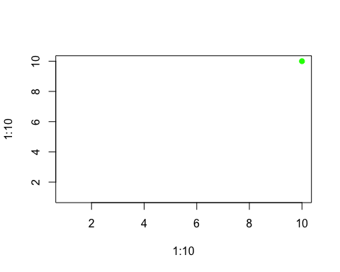<!-- -->

If `times` has multiple non-unique values, then each set of points corresponding 
to a single value of `times` will be plotted together, in a single frame. So, this
snippet plots our points two at a time:


```r
times <- rep(1:5, each=2)
times
```

```
##  [1] 1 1 2 2 3 3 4 4 5 5
```

```r
anim.plot(1:10, 1:10, times=times, col="green", pch=19)
```

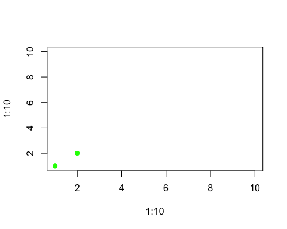<!-- -->

There are two shortcuts you can use. First, if `times` is a single number, `anim.plot`
will create that many frames, each with an equal number of points. So the following code would have just the same result as the previous example:


```r
anim.plot(1:10, 1:10, times=5, col="green", pch=19)
```

Second, if you don't specify `times` at all, it will guess that you want to 
plot one point at a time. So


```r
anim.plot(1:10, 1:10, col="green", pch=19)
```

will plot 10 frames.

## Recycling arguments

You can animate more than just the location of points. Here are the first
twenty plot symbols, in different colours:


```r
cols <- c("green", "blue", "red", "orange", "purple")
y <- rep(2:1, each=10)
anim.plot(1:10, y, times=1:20, col=cols, pch=1:20, cex=3,
  ylim=c(0.5,2.5))
```

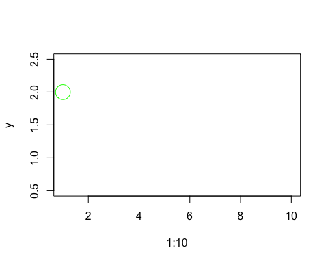<!-- -->

The `pch` and `col` arguments control the plot symbol and colour, just as they
do in the `plot` command. `pch` goes from 1 to 20, so a different plot symbol
is shown in each frame. `cols` has five values, so it is recycled four times.
(And `cex`, which controls the size of the plot symbol, has one value, so it is
recycled twenty times! In fact, this was already happening in the earlier plots,
with `pch=19` and `col='green'`.)

This example demonstrates _rule one_ of recycling arguments in `anim.plots`:

* Per-point arguments are recycled to the total number of points plotted.

"Per-point arguments" means arguments like `cex`, `pch` and `col` which can be
different for different points. 

This way of working should be familiar. In the `plot` command, you can 
plot different points with different colours by specifying a vector argument to `col`. 
Here, in the same way, you can plot points with different colours 
*across multiple frames of animation*.

You can also recycle `x` and `y` values. The example sets `x=1:10`, and this
is used twice to produce two rows of plots.

Not all arguments work on each point. Some arguments work on a whole plot at once.
But when you are animating, you can change those arguments too. The next command
plots our symbols five at a time, and shows an appropriate title.


```r
titles <- paste("Symbols", c(1,6,11,16), "to", c(5,10,15,20))
anim.plot(rep(1:10,2), rep(2:1, each=10), times=4, pch=1:20, cex=3, main=titles, ylim=c(0,3))
```

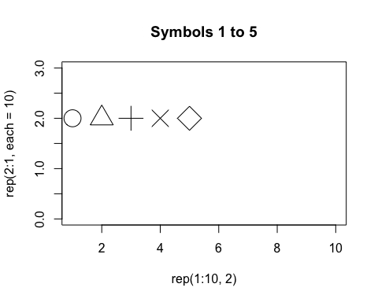<!-- -->

There are four frames, and `titles` is a vector of length 4, one for each frame.
_Rule two_ of `anim.plots` is:

* Per-plot arguments are recycled to the total number of frames in the animation.

Now you just need to know one more thing about argument recycling in `anim.plots`. 
To illustrate it, let's suppose we want to animate "zooming in" on a distribution
of points. To do that, we will change the `xlim` and `ylim` arguments to `plot`.
These give the left/right, and top/bottom edges of the plot window. They are
length two vectors. 

You might think we would just pass in a vector of `xlim` values, twice the length of
the number of frames, and chop it up with two `xlim` values for each frame. But 
in general this wouldn't work very well -
what if we want to pass in more complex arguments, like vectors with arbitrary
lengths, or matrices?

Instead, we pass in a 2-by-n matrix of `xlim` values. This is sliced up into columns, and
one column is used for each frame. Here's the code:


```r
 x <- rep(rnorm(4000), 40)
 y <- rep(rnorm(4000), 40)
 lims <- 4*0.95^(1:40)
 ylims <- xlims <- rbind(lims, -lims) 
 # First five values of xlims: 
 xlims[,1:5]
```

```
##      [,1]  [,2]    [,3]      [,4]      [,5]
## lims  3.8  3.61  3.4295  3.258025  3.095124
##      -3.8 -3.61 -3.4295 -3.258025 -3.095124
```

```r
 anim.plot(x, y, times=40, speed=5, xlim=xlims, ylim=ylims, 
       col=rgb(runif(4000), 0, runif(4000), .3), pch=19)
```

<!-- -->

We repeat our x and y values 40 times, so we will plot the same points, but
within different bounds. The plot zooms in by 5% each time.

So, _rule three_ for recycling parameters is:

* Complex per-plot parameters are passed in as a matrix, which is sliced up to give
one vector per frame.

For more complex arguments, you can pass them in as a 3-or-more dimensional array.
Later we'll see an example in `anim.persp`.

## Creating incremental plots

Paradoxically, we don't always want to plot "one time at a time". Sometimes
we may want to add points incrementally. There is a simple way to do this, using
the `window` argument to `anim.plot`.

The default value of the `window` argument is `window=t`. This plots all the
points from time t at time t. By using a different expression involving `t`,
you can change the set of points that gets plotted. For example, `window=1:t`
will plot everything from time 1 to time t. Let's use this for a statistical
demonstration of the effect of increasing sample size. 


```r
allx <- rnorm(400)
ally <- allx + rnorm(400)
anim.plot(allx, ally, times=40, window=1:t, col=rgb(0, 0, 0, 0.5), pch=19, 
      main=paste("Sample size", 1:40*10))
```

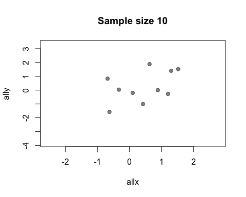<!-- -->

As `t` grows, the set of points plotted increases and the relationship between
x and y becomes clearer.

You may be wondering why `window` doesn't also affect the `main` argument
and mess up your plot titles. The short answer is, magic ;-) The long answer is
that `anim.plots` knows the difference between per-plot and per-point arguments: only per-point arguments are affected by `window`.

You don't actually need `window` for this example: you could just use
`anim.points` to add points incrementally to an animation. Our next trick
uses `window` for something cleverer. We animate the number of discoveries 
made over the years 1860-1959, from the `discoveries` dataset.


```r
xlim <- rbind(1840:1939,1860:1959)
anim.plot(1860:1959, discoveries, times=100, xlim=xlim, col="red", xlab="Year",
     xaxp=rbind(xlim, 10), window=(t-20):t, type="b", lwd=5, speed=4)
```

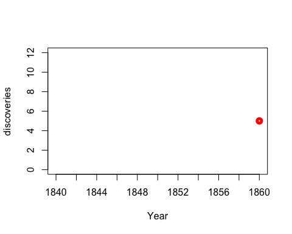<!-- -->

Here, we display discoveries in a 20-year window: `(t-20):t`.

## Replaying plots

`anim.plot` and similar functions return an object of class `anim.frames`. 
You can capture this and replay it in whole or part.

Let's rerun our statistical demonstration. First, we use the `show=FALSE`
argument to create an `anim.frames` object without displaying it. 


```r
allx <- rnorm(200)
ally <- allx + rnorm(200, 0, 2)
stat.demo <- anim.plot(allx, ally, times=20, window=1:t, col=rgb(0, 0, 0, 0.5), 
      pch=19, main=paste("Sample size", 1:20*10), show=FALSE)
```

Now we display the first five frames, and add a regression line:


```r
replay(stat.demo, frames=1:5)
```

```r
abline(lm(ally[1:50] ~ allx[1:50]), col="red", lwd=2)
```

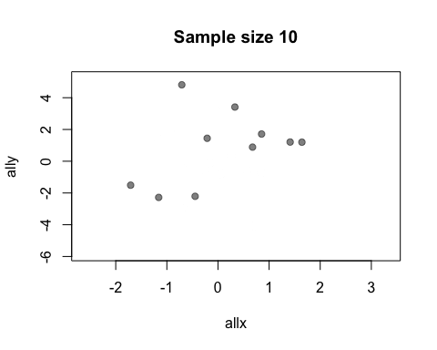<!-- -->

Notice that you can add standard R graphics like `abline`. This is
not surprising: really, everything in the animation is done by normal graphics
functions. 

Sometimes we need to call a separate function to change the plot. For example,
to add a legend to a standard plot, you need to use the `legend` function. We
can't just do this at the end, because we want it to be shown during the whole
animation. 

To do this, you can use the `after` argument to `replay`. For example, the next
animation shows the growth of fifty chicks who are fed one of four different 
diets. We add a legend showing the diets.


```r
ChickWeight$chn <- as.numeric(as.factor(ChickWeight$Chick))
chw.anim <- anim.plot(ChickWeight$chn, ChickWeight$weight, 
      times=ChickWeight$Time, col=as.numeric(ChickWeight$Diet), 
      pch=as.numeric(ChickWeight$Diet), speed=3, show=FALSE)

replay(chw.anim, after=legend("topleft", legend=paste("Diet", 1:4), pch=1:4, 
      col=1:4))
```

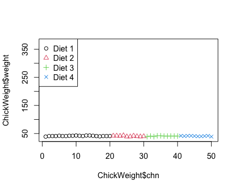<!-- -->

The argument to `after` will be evaluated after each frame of the animation.

When `after` is evaluated, the arguments to the preceding function call are
available in its environment. This lets you do things like data summaries.
Here is our sample size demo again, but now we'll add a regression line
at each frame.


```r
replay(stat.demo, after={
        abline(lm(ally~allx), col="red")
        abline(lm(y~x), pty=1, lty=2, col="grey2") 
        legend("topleft", lty=2:1, col=c("grey2", "red"), legend=c("Estimate", 
              "True"))
      })
```

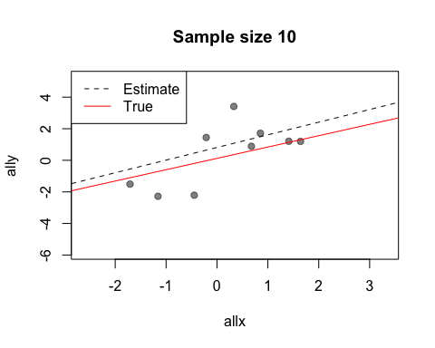<!-- -->

Look at the first two calls to `abline`. The first call uses `allx` and `ally`,
data from the global environment. The second call uses `x` and `y`. These are
the names of the first two arguments to `plot` - the data that has been plotted.
Notice also how we use curly brackets (`{}`) to run multiple statements after
each plot.

There is also a `before` argument to call a function before the main plot is
run. For more complicated plots, you can `merge` two `anim.frames` objects: more 
on this below.

## Other functions and formula interface

Like many plot functions, `anim.plot` has a formula interface.
The following command would show the plot of chick growth again, and is much 
easier to type.


```r
anim.plot(weight ~ chn + Time, data=ChickWeight, col=as.numeric(Diet), 
     pch=as.numeric(Diet), speed=3)
```

The format is `y ~ x + times`. As you can see, other arguments also get 
evaluated in the environment provided by `data`.

As well as the standard plot function, `anim.plots` provides animated versions
of several others. `anim.hist` is a histogram:


```r
anim.hist(rep(rnorm(5000), 7), times=rep(1:7, each=5000), 
     breaks=c(5,10,20,50,100,200, 500, 1000))
```

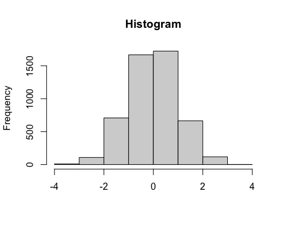<!-- -->

`anim.curve` plots a mathematical curve. The value `t` changes over time.


```r
anim.curve(sin(x*t), times=1:30, n=100, speed=12, col="darkgreen", from=-1, to=1)
```

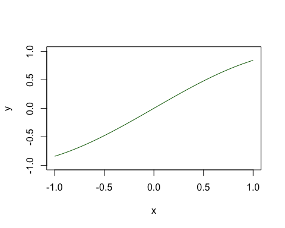<!-- -->

`anim.contour` does contour plots. Here's the map of the Maunga Whau volcano
in Auckland, emerging from a sphere.


```r
# create a sphere:
tmp <- volcano
tmp[] <- 200 - ((row(tmp) - 43)^2 + (col(tmp) - 30)^2)/20
# an animated contour needs a 3D array:
cplot <- array(NA, dim=c(87,61,20))
cplot[,,1] <- tmp
cplot[,,20] <- volcano
# morph the volcano into a circle:
cplot <- apply(cplot, 1:2, function(x) seq(x[1], x[20], length.out=20))
cplot <- aperm(cplot, c(2,3,1))
dim(cplot) # the third dimension is time
```

```
## [1] 87 61 20
```

```r
anim.contour(z=cplot, times=1:20, speed=3, levels=80 + 1:12*10, lty=c(1,2,2))
```

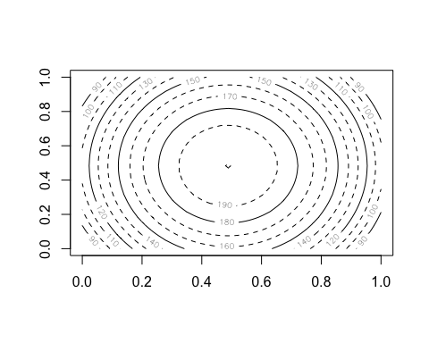<!-- -->

The closely related `anim.persp` does animated 3D plots.


```r
par(mar=rep(.4,4))
cplot2 <- apply(cplot, 1:2, function(x) seq(94, x[20], length.out=20))
cplot2 <- aperm(cplot2, c(2,3,1)) 

anim.persp(z=cplot2, times=1:20, phi=15:34, theta=30:49, speed=5, border=NA, 
        col="yellowgreen", shade=.5, box=FALSE)
```

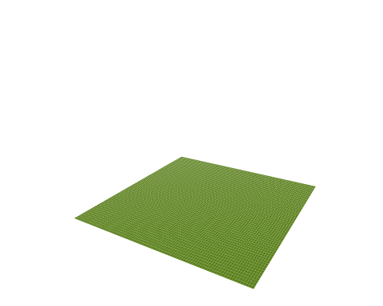<!-- -->


Both of these provide a 3D array as their first argument. This 3D 
array is sliced up, and each slice is passed to `contour` or `persp` to create
a separate frame.

`anim.barplot` is a little tricky. You can pass it a vector, which
will be cut up according to `times` to create a single-D barplot. Or you can 
pass it a 3D matrix which will be sliced up to create a multiple barplot (either
stacked or side-by-side). The example shows 20 rounds of a laboratory public
goods game, dividing subjects up by the amount they contributed and showing
whether or not their fellow group members punished them.


```r
prop <- prop.table(PGgame, 2:3)
prop[, , 1:2]
```

```
## , , Period = 1
## 
##        Contribution
## Picked  Non-unique lowest Not lowest/all same Unique lowest
##   FALSE         1.0000000           1.0000000     0.5909091
##   TRUE          0.0000000           0.0000000     0.4090909
## 
## , , Period = 2
## 
##        Contribution
## Picked  Non-unique lowest Not lowest/all same Unique lowest
##   FALSE         0.9047619           1.0000000     0.7391304
##   TRUE          0.0952381           0.0000000     0.2608696
```

```r
anim.barplot(prop, main=paste("Period", 1:20), legend=TRUE, ylim=c(0, 1.5),
      col=c("grey", "red"),
      args.legend=list(x="topright", legend=c("Punished", "Not punished"), 
      bty="n", horiz=TRUE))
```

<!-- -->

Lastly, most of the usual `points`-style functions have animated versions.
In particular there are `anim.points`, `anim.lines`, `anim.text` and
`anim.symbols`. All these will add to an existing plot, rather than create a new one.

Here, we use `anim.lines` to recreate an animated version of a famous plot. (You will need the `maps` library installed to see it.)

**Note**: as of November 2014, this and the subsequent plot don't show in `knitr`.
They work if run from the command line, however.


```r
 if (require('maps')) {
   map('world', xlim=c(22, 40), ylim=c(52,58), fill=TRUE, col=c("wheat", "sienna1"))
   if (require('mapdata')) map('rivers', add=TRUE)
   title("March of the Grande Armee on Moscow")
   points(cities$long, cities$lat, pch=18)
   text(cities$long, cities$lat, labels=cities$city, pos=4, cex=.7)
   with(troops[troops$group==1,], anim.lines(x=long,
         y=lat, window=t:(t+1), speed=2, lwd=survivors/10000,
        col=rgb(.3,.16,.16)))
}
```

```
## Loading required package: mapdata
```

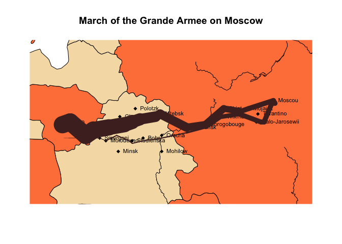<!-- -->

 There are also `anim.segments` and `anim.arrows`. Like `anim.points` and friends, these functions add to the plot between frames, rather than redrawing it. The convenience functions `anim.arrowplot` and `anim.segmentplot` redraw the plot before they are called.
 
Below we draw the paths of all 2009 hurricanes, starting them all simultaneously at their first recorded time.
 

```r
if (require('maps')) {
  hr <- subset(hurricanes, lat > 0 & lat < 50 & lon > -95 & lon < -20 &
        Shour %% 6 == 0)
  hr$dlat <- cos(hr$diruv/360*2*pi) * hr$maguv / 8
  hr$dlon <- sin(hr$diruv/360*2*pi) * hr$maguv / 8
  hr$name <- sub("\\s+$", "", hr$name)
  map('world', xlim=c(-95,-20), ylim=c(0,50), fill=TRUE, col=terrain.colors(10))
  title("Hurricanes, 2009")
  with(hr[!duplicated(hr$name),], text(lon, lat, labels=paste0(name, "\n", Yr), cex=0.8))
  with(hr, anim.arrows(x0=lon, y0=lat, y1=lat+dlat, x1=lon+dlon, times=Shour, 
        speed=12, col=rgb(0,0,1,0.8), length=.1, lwd=2))
}
```

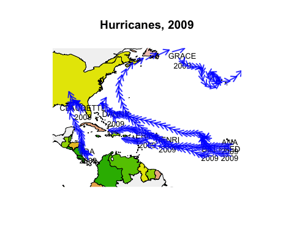<!-- -->

Now we've got almost all the tools we need to create our own Gapminder-style animation. The last tool is the `merge` method for two `anim.frames` objects.
This creates a single animation from two objects. We use it below to
add labels to the larger countries.


```r
pl <- palette(adjustcolor(rainbow(23), 1, .6, .6, .6, offset=c(0,0,0,-0.1)))

blobs <- anim.plot(lifex ~ GDP + year, data=gm_data, log="x",
      cex=sqrt(pop)*0.0004, pch=19, col=region, xlab="GDP", 
      ylab="Life expectancy", speed=7, subset=year > 1850, show=FALSE)
cnames <- anim.text(lifex ~ GDP + year, data=gm_data,
      labels=country, speed=7, subset=year > 1850 & pop > 50000000, 
      show=FALSE, cex=0.7, col="darkorange")
replay(merge(blobs, cnames))
```

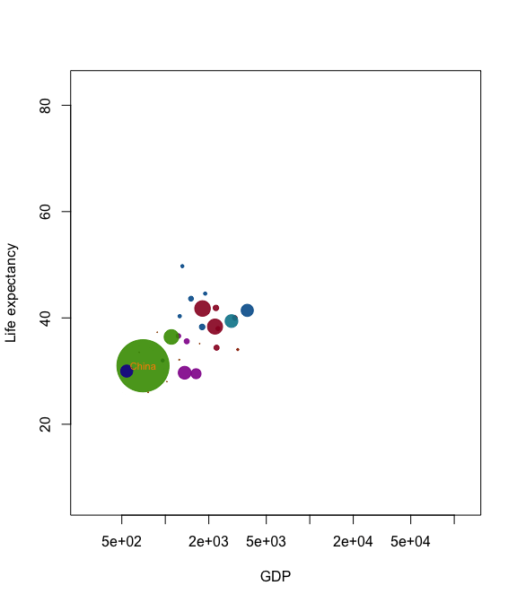<!-- -->

```r
palette(pl)
```

Merging is quite primitive - it simply interleaves graphics calls. Don't
expect it to put different plots on the same window unless one of the calls
is to a function like `points`.

## Tips and tricks

To replay plots faster or slower, use the `speed` argument. `knitr` doesn't
display this nicely in this document, but it will work for you.

Similarly, if you have different intervals between your values of `times`, 
`anim.plots` will respect these when they are played. For example


```r
anim.plot(1:5, 1:5, times=c(1,2,8,9,10))
```

will show a long pause between the second and third frames. To turn this feature
off, pass the argument `use.times=FALSE`.

You can process arguments for each individual plot using the `window.process` argument. This should be a function which takes two arguments - a list of 
arguments to plot, and a vector of `times`. It should return the plot arguments,
suitably processed. This can be useful for, e.g., drawing animated movement:


```r
anim.plot(1:100, 1:100 + sin(1:100/3)*5, speed=10, window=(t-5):t, 
      window.process = function(args, times){
        args$col <- rgb(0,0,0,0:5/5) # fade shadows
        return(args)
      })
```

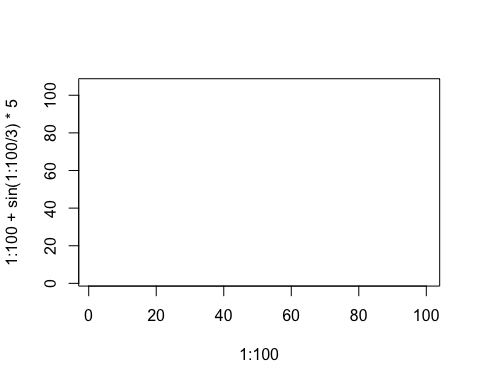<!-- -->

Lastly, if you're feeling adventurous, you can pass a different function than
`plot` into `anim.plot` using the `fn` argument. (Quite a few of the built-in
functions work this way.) You may even be able to use `ggplot` or similar....

## Saving your plots

The function `anim.save()` will save your `anim.frames` objects. It simply calls
the underlying functions from the `animation` package.

These functions do not respect changes in animation speed. For example, the 
following code would show a rocket boosting off:


```r
tmp <- anim.plot(1, 1:30, times=sqrt(1:30))
```

But when you save it, it will go at constant speed. To get round this, run e.g.:


```r
anim.save(anim.smooth(tmp, fps=10), type="Video", filename="rocket.mp4")
```

The `anim.smooth` function creates a "smoothed" version of the animation, which
plays each frame after a constant interval. This involves creating many more 
frames, so when you play it in R, it will probably look slower. However, when
you save it, it should look right.

## Getting help and contributing

The code lives at http://github.com/hughjonesd/anim.plots, and issues
can be reported at http://github.com/hughjonesd/anim.plots/issues. Enjoy!


